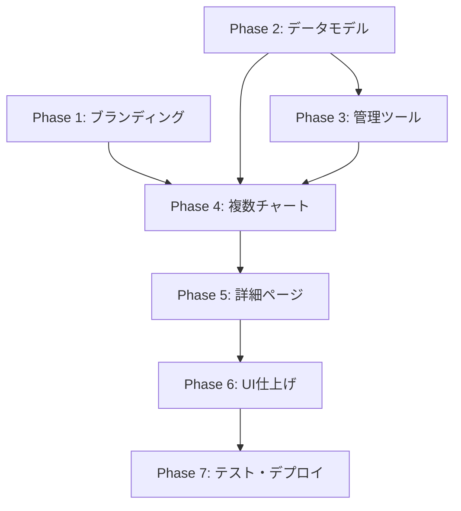

# K-STAR PROJECT 実装計画

**作成日**: 2026-03-26
**アーキテクチャ**: 静的JSON方式
**ステータス**: 計画中

---

## プロジェクト概要

| 項目 | 内容 |
|------|------|
| **プロジェクト名** | K-STAR PROJECT |
| **目的** | K-POP専用の音楽チャートWebサイト |
| **ベース** | Billboard Hot 100 クローンテンプレート |
| **技術スタック** | React 19 + TypeScript + Vite 7 + Tailwind CSS 4 + shadcn/ui |

---

## 要件サマリー

| 項目 | 決定事項 |
|------|----------|
| **データソース** | 管理ツールからJSON生成 |
| **チャート種類** | 複数（楽曲、アルバム、アーティスト、ストリーミング等） |
| **ユーザー機能** | 不要（閲覧のみ） |
| **リリース方針** | フル機能 |
| **アーキテクチャ** | 静的JSON方式（[詳細](./ARCHITECTURE_DECISION.md)） |

---

## 実装フェーズ

### Phase 1: ブランディング変更 & 基盤整備

**複雑度**: Low
**依存関係**: なし

#### 作業内容

- [ ] Billboard → K-STAR へのブランド名変更
- [ ] ロゴ・ヘッダー・フッターの更新
- [ ] HeroSection のデザイン変更 (HOT 100 → K-STAR CHART)
- [ ] カラースキーム調整（必要に応じて）
- [ ] サイトタイトル・メタデータ更新
- [ ] ファビコン作成

#### 対象ファイル

```
client/src/components/Header.tsx
client/src/components/HeroSection.tsx
client/src/components/Sidebar.tsx
client/src/pages/Home.tsx
client/src/index.css
client/index.html
```

#### 完了条件

- サイト全体で「K-STAR」ブランドが表示される
- Billboardの名称が残っていない

---

### Phase 2: データモデル設計 & 拡張

**複雑度**: Medium
**依存関係**: なし

#### 作業内容

- [ ] 複数チャートタイプ対応のTypeScript型定義
- [ ] K-POPアーティスト用のデータ構造設計
- [ ] チャートカテゴリ定義
- [ ] サンプルJSONデータ作成

#### 新規データ型

```typescript
// client/src/lib/types.ts

// チャートタイプ
export type ChartType =
  | 'songs'
  | 'albums'
  | 'artists'
  | 'streaming'
  | 'digital'
  | 'physical';

// トレンド方向
export type TrendDirection =
  | 'up'
  | 'down'
  | 'same'
  | 'new'
  | 're-entry';

// アーティスト
export interface Artist {
  id: string;
  name: string;
  nameKo?: string;      // 韓国語名
  nameJa?: string;      // 日本語名
  group?: string;       // 所属グループ（ソロの場合は省略）
  agency: string;       // 事務所
  image: string;
  debutDate: string;
  members?: string[];   // グループの場合のメンバー
}

// 楽曲
export interface Song {
  id: string;
  title: string;
  titleKo?: string;
  titleJa?: string;
  artistId: string;
  artistName: string;   // 表示用
  albumId?: string;
  albumName?: string;
  releaseDate: string;
  coverImage: string;
  duration?: number;    // 秒
  youtubeId?: string;   // MV
  spotifyId?: string;
}

// アルバム
export interface Album {
  id: string;
  title: string;
  titleKo?: string;
  artistId: string;
  artistName: string;
  releaseDate: string;
  coverImage: string;
  trackCount: number;
  albumType: 'full' | 'mini' | 'single' | 'repackage';
}

// 楽曲チャートエントリー
export interface SongChartEntry {
  rank: number;
  previousRank: number | null;
  peakPosition: number;
  weeksOnChart: number;
  songId: string;
  title: string;
  artist: string;
  coverImage: string;
  trend: TrendDirection;
  isNew?: boolean;
  // オプション: ストリーミング数など
  streams?: number;
  downloads?: number;
}

// アルバムチャートエントリー
export interface AlbumChartEntry {
  rank: number;
  previousRank: number | null;
  peakPosition: number;
  weeksOnChart: number;
  albumId: string;
  title: string;
  artist: string;
  coverImage: string;
  trend: TrendDirection;
  isNew?: boolean;
  sales?: number;
}

// アーティストチャートエントリー
export interface ArtistChartEntry {
  rank: number;
  previousRank: number | null;
  peakPosition: number;
  weeksOnChart: number;
  artistId: string;
  name: string;
  image: string;
  trend: TrendDirection;
  topSong?: string;     // 現在の最高位楽曲
}

// チャート週データ
export interface ChartWeek<T = SongChartEntry> {
  id: string;
  chartType: ChartType;
  weekStart: string;    // ISO 8601
  weekEnd: string;
  publishedAt: string;
  entries: T[];
}

// チャートメタデータ
export interface ChartMeta {
  chartType: ChartType;
  name: string;
  nameKo?: string;
  description: string;
  updateSchedule: string;  // e.g., "毎週金曜 18:00"
}
```

#### JSONデータ構造

```
data/
├── meta/
│   └── charts.json           # チャート種類のメタデータ
├── artists/
│   ├── index.json            # アーティスト一覧
│   └── [artistId].json       # 個別アーティスト詳細
├── songs/
│   └── index.json            # 楽曲一覧
├── albums/
│   └── index.json            # アルバム一覧
└── charts/
    ├── songs/
    │   ├── 2025-03-22.json   # 週別楽曲チャート
    │   └── 2025-03-15.json
    ├── albums/
    │   └── 2025-03-22.json
    └── artists/
        └── 2025-03-22.json
```

#### 完了条件

- 全ての型定義が完了
- サンプルJSONデータ（最低1週分）が作成済み
- 型とJSONの整合性が確認済み

---

### Phase 3: ローカル管理ツールの実装

**複雑度**: High
**依存関係**: Phase 2

#### 作業内容

- [ ] 管理ツール用Reactアプリのセットアップ
- [ ] チャートデータ入力フォーム
- [ ] アーティスト管理UI
- [ ] 楽曲・アルバム管理UI
- [ ] JSON出力機能
- [ ] CSV/JSONインポート機能
- [ ] プレビュー機能

#### ファイル構成

```
admin-tool/
├── package.json
├── vite.config.ts
├── tsconfig.json
├── src/
│   ├── main.tsx
│   ├── App.tsx
│   ├── components/
│   │   ├── ChartEditor.tsx       # チャート編集
│   │   ├── ChartEntryRow.tsx     # チャートエントリー行
│   │   ├── ArtistManager.tsx     # アーティスト管理
│   │   ├── ArtistForm.tsx        # アーティスト編集フォーム
│   │   ├── SongManager.tsx       # 楽曲管理
│   │   ├── AlbumManager.tsx      # アルバム管理
│   │   ├── BulkImport.tsx        # 一括インポート
│   │   ├── JsonPreview.tsx       # JSON出力プレビュー
│   │   └── ui/                   # 共有UIコンポーネント
│   ├── lib/
│   │   ├── storage.ts            # ローカルストレージ/ファイル操作
│   │   ├── export.ts             # JSON出力
│   │   └── import.ts             # CSV/JSONインポート
│   └── types/
│       └── index.ts              # 型定義（client と共有）
└── output/                       # 生成されたJSONの出力先
```

#### 主要機能

**チャート編集画面**:
```
┌─────────────────────────────────────────────────┐
│  K-STAR 管理ツール                              │
├─────────────────────────────────────────────────┤
│  チャート種類: [楽曲 ▼]  週: [2025-03-22]       │
├─────────────────────────────────────────────────┤
│  # │ 楽曲名          │ アーティスト │ 前週 │ 操作 │
│  1 │ [Super        ] │ [NewJeans  ] │ [2 ] │ [↑↓] │
│  2 │ [APT.         ] │ [ROSÉ      ] │ [1 ] │ [↑↓] │
│  3 │ [Magnetic     ] │ [ILLIT     ] │ [3 ] │ [↑↓] │
│  ...                                            │
├─────────────────────────────────────────────────┤
│  [+ エントリー追加]  [インポート]  [エクスポート] │
└─────────────────────────────────────────────────┘
```

**アーティスト管理画面**:
```
┌─────────────────────────────────────────────────┐
│  アーティスト管理                                │
├─────────────────────────────────────────────────┤
│  [検索...]                      [+ 新規追加]    │
├─────────────────────────────────────────────────┤
│  名前          │ 事務所      │ デビュー │ 操作  │
│  NewJeans      │ ADOR        │ 2022     │ [編集]│
│  SEVENTEEN     │ PLEDIS      │ 2015     │ [編集]│
│  aespa         │ SM          │ 2020     │ [編集]│
└─────────────────────────────────────────────────┘
```

#### 完了条件

- 管理ツールが起動し、データ入力が可能
- JSON出力が正しいフォーマットで生成される
- インポート機能が動作する

---

### Phase 4: フロントエンド - 複数チャート対応

**複雑度**: Medium
**依存関係**: Phase 2

#### 作業内容

- [ ] チャートタイプ切り替えUI
- [ ] 各チャートタイプ専用の表示コンポーネント
- [ ] サイドバーのチャートカテゴリ更新
- [ ] ルーティング追加
- [ ] JSONデータの読み込みロジック

#### 新規ページ

```
client/src/pages/
├── Home.tsx              # ホーム（メインチャート表示）
├── charts/
│   ├── SongChart.tsx     # 楽曲チャート
│   ├── AlbumChart.tsx    # アルバムチャート
│   ├── ArtistChart.tsx   # アーティストチャート
│   └── StreamingChart.tsx # ストリーミングチャート
└── ChartHistory.tsx      # 過去チャート一覧
```

#### 新規コンポーネント

```
client/src/components/
├── charts/
│   ├── SongChartEntry.tsx     # 楽曲エントリー行
│   ├── AlbumChartEntry.tsx    # アルバムエントリー行
│   ├── ArtistChartEntry.tsx   # アーティストエントリー行
│   ├── ChartHeader.tsx        # チャートヘッダー
│   └── ChartStats.tsx         # チャート統計
├── ChartTypeSelector.tsx      # チャートタイプ切り替え
├── ChartNavigation.tsx        # 週移動ナビゲーション
└── WeekPicker.tsx             # 週選択
```

#### ルーティング

```typescript
// client/src/App.tsx
<Switch>
  <Route path="/" component={Home} />
  <Route path="/charts/songs" component={SongChart} />
  <Route path="/charts/songs/:date" component={SongChart} />
  <Route path="/charts/albums" component={AlbumChart} />
  <Route path="/charts/albums/:date" component={AlbumChart} />
  <Route path="/charts/artists" component={ArtistChart} />
  <Route path="/history" component={ChartHistory} />
  <Route component={NotFound} />
</Switch>
```

#### 完了条件

- 全チャートタイプが表示可能
- チャート間のナビゲーションが動作
- 過去チャートが閲覧可能

---

### Phase 5: アーティスト・楽曲詳細ページ

**複雑度**: Medium
**依存関係**: Phase 2, Phase 4

#### 作業内容

- [ ] アーティスト詳細ページ
- [ ] 楽曲詳細ページ
- [ ] アルバム詳細ページ
- [ ] チャート履歴グラフ（recharts活用）
- [ ] 関連楽曲・アルバム表示

#### 新規ページ

```
client/src/pages/
├── ArtistDetail.tsx      # アーティスト詳細
├── SongDetail.tsx        # 楽曲詳細
└── AlbumDetail.tsx       # アルバム詳細
```

#### アーティスト詳細ページ構成

```
┌─────────────────────────────────────────────────┐
│  [画像]  NewJeans                               │
│          뉴진스                                 │
│          ADOR / HYBE                           │
│          デビュー: 2022.07.22                   │
├─────────────────────────────────────────────────┤
│  チャート履歴                                   │
│  [グラフ: 順位推移]                             │
├─────────────────────────────────────────────────┤
│  楽曲                                          │
│  ├── Super (#1, 4週)                           │
│  ├── Ditto (#1, 12週)                          │
│  └── ...                                       │
├─────────────────────────────────────────────────┤
│  アルバム                                       │
│  ├── How Sweet (2024)                          │
│  └── ...                                       │
└─────────────────────────────────────────────────┘
```

#### ルーティング追加

```typescript
<Route path="/artists/:id" component={ArtistDetail} />
<Route path="/songs/:id" component={SongDetail} />
<Route path="/albums/:id" component={AlbumDetail} />
```

#### 完了条件

- 各詳細ページが表示可能
- チャート履歴グラフが描画される
- 関連コンテンツへのリンクが動作

---

### Phase 6: レスポンシブ対応 & UI仕上げ

**複雑度**: Low
**依存関係**: Phase 5

#### 作業内容

- [ ] モバイルファーストの最適化
- [ ] タブレット対応
- [ ] ダークモード確認・調整
- [ ] アニメーション・トランジション追加
- [ ] ローディング状態の実装
- [ ] エラー状態の実装
- [ ] アクセシビリティ対応（WCAG 2.1 AA）
- [ ] パフォーマンス最適化

#### ブレークポイント

| サイズ | 幅 | レイアウト |
|--------|-----|-----------|
| Mobile | < 640px | 1カラム、サイドバー非表示 |
| Tablet | 640-1024px | 1カラム、サイドバー折りたたみ |
| Desktop | > 1024px | 2カラム、サイドバー表示 |

#### パフォーマンス最適化

- [ ] 画像の遅延読み込み（Intersection Observer）
- [ ] JSONデータのキャッシュ
- [ ] コンポーネントの遅延読み込み（React.lazy）
- [ ] 仮想スクロール（100件以上のリスト）

#### 完了条件

- Lighthouse スコア 90+ (Performance, Accessibility)
- 全デバイスで正しく表示される

---

### Phase 7: テスト & デプロイ準備

**複雑度**: Medium
**依存関係**: Phase 6

#### 作業内容

- [ ] 単体テスト（Vitest）
- [ ] コンポーネントテスト（Testing Library）
- [ ] E2Eテスト（Playwright）
- [ ] ビルド最適化
- [ ] 環境変数設定
- [ ] デプロイ設定（Vercel）
- [ ] CI/CD設定（GitHub Actions）

#### テストカバレッジ目標

| 種類 | 対象 | 目標 |
|------|------|------|
| 単体テスト | ユーティリティ関数 | 80%+ |
| コンポーネントテスト | 主要コンポーネント | 70%+ |
| E2Eテスト | 主要ユーザーフロー | 5シナリオ+ |

#### デプロイ設定

```yaml
# vercel.json
{
  "buildCommand": "pnpm build",
  "outputDirectory": "dist",
  "framework": "vite"
}
```

#### GitHub Actions

```yaml
# .github/workflows/deploy.yml
name: Deploy
on:
  push:
    branches: [main]
jobs:
  deploy:
    runs-on: ubuntu-latest
    steps:
      - uses: actions/checkout@v4
      - uses: pnpm/action-setup@v2
      - run: pnpm install
      - run: pnpm build
      - uses: amondnet/vercel-action@v25
```

#### 完了条件

- 全テストが通過
- Vercelへのデプロイが成功
- 本番URLでアクセス可能

---

## 実装順序



**推奨順序**:
```
Phase 1 → Phase 2 → Phase 3 & Phase 4 (並行可能) → Phase 5 → Phase 6 → Phase 7
```

---

## リスク評価

| リスク | レベル | 対策 |
|--------|--------|------|
| 管理ツールの複雑さ | 🟡 MEDIUM | シンプルなフォームから開始、段階的に機能追加 |
| データ入力の手間 | 🟡 MEDIUM | CSV/JSONインポート機能を優先実装 |
| 画像管理 | 🟡 MEDIUM | 外部URL参照 or Cloudinary使用 |
| Git運用 | 🟢 LOW | 個人管理のため競合リスク低 |

---

## 関連ドキュメント

- [ARCHITECTURE_DECISION.md](./ARCHITECTURE_DECISION.md) - アーキテクチャ決定記録

---

## 変更履歴

| 日付 | 変更内容 | 担当 |
|------|----------|------|
| 2026-03-26 | 初版作成 | - |
